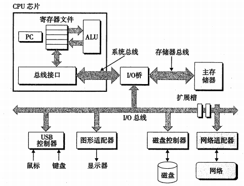
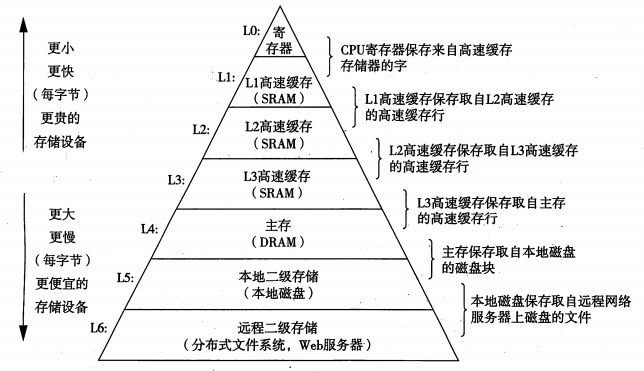
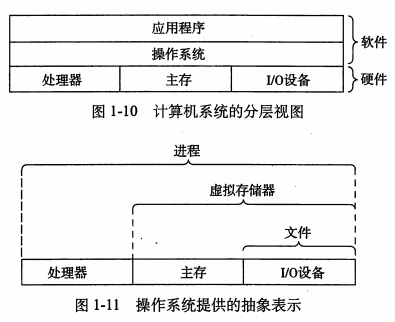
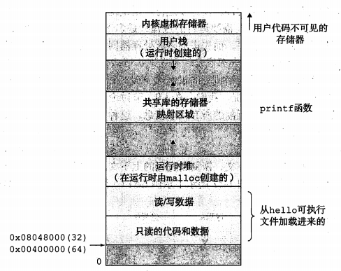
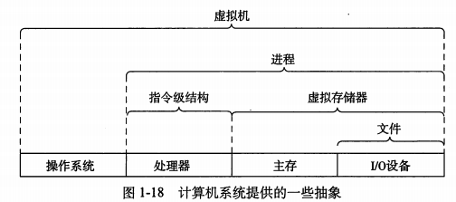

##1.1 信息就是位+上下文
系统中所有的信息都是一串位表示的。区分不同数据对象的唯一方法是我们读到这些数据对象的上下文。

##1.2 程序被其它程序翻译成不同的格式
编译系统的四个部分（**预处理器**、**编译器**、**汇编器**、**链接器**），对应于以下四个阶段：

- **预处理阶段**：将头文件中的代码直接插入到源程序中，生成.i文件
- **编译阶段**：将代码翻译成汇编语言，生成.s汇编代码文件
- **汇编器**：将汇编代码转为机器语言，生成可重定位目标程序（obj文件）
- **链接器**：将obj文件合并，生成可执行文件

##1.3 了解编译系统如何工作是大有益处的
- 优化程序性能：了解编译系统内在机制有助于编写编译系统友好型的代码，从而提高程序性能
- 理解链接时出现的错误：构建大型软件系统时避免出现因链接而产生的若干问题
- 避免安全漏洞：程序被加载到内存后执行，怎样避免出现缓冲区溢出漏洞
##1.4 处理器读并解释存储在存储器中的指令
**系统硬件组成部分**：总线、I/O设备、主存、处理器

**运行hello程序的过程**：
在键盘上输入./hello回车（从键盘到寄存器），外壳程序执行一系列指令加载可执行文件hello文件（从磁盘到内存），显示器出现hello world（从内存到显示器）

##1.5 高速缓存至关重要
处理器与主存之间运行速度的差异，引进了高速缓存来保存近期可能会用到的数据（利用了程序的局部性原理）。

##1.6 存储设备形成层次结构

##1.7 操作系统管理硬件
**操作系统两个基本功能**：

1. 防止硬件被应用程序滥用；
2. 向应用程序提供简单一致的机制（进程、虚拟存储器和文件）来控制低级设备。

**进程和线程**：
进程是操作系统对正在运行的程序一种抽象。系统可以同时运行多个进程，而单CPU同时只能执行一个进程，操作系统负责进程之间的切换（上下文切换）来实现伪并发。
线程是操作系统调度的最小单位，一个进程可以由多个线程单元组成，每个线程运行在同一个进程的上下文，共享相同的代码段和全局数据，线程之间的数据共享比进程会更加高效。

**虚拟存储器**：
虚拟存储器是给进程的一个假象，即每个进程都在独占使用内存，称为进程的虚拟地址空间。虚拟地址空间分为若干个区域：程序代码和数据、堆、栈和内核虚拟存储器。

**并行的多个抽象层次**：

- **线程级并行**：多核处理器和超线程技术（单个CPU执行多个控制流、涉及CPU某些硬件有多个备份）
- **指令级并行**：在较低抽象层次上，处理器同时执行多条指令的属性称为指令级并行（如流水线技术）
- **单指令多数据并行**：允许一条指令产生多个可以并行执行的操作

